```{r setup, include=FALSE}
knitr::opts_chunk$set(echo = FALSE)

library(ggplot2)
library(mvtnorm)
library(gplite)
library(gridExtra)
library(plgp)
library(data.table)
library(plotly)

set.seed(5467)
```


# Motivation

## Non-linear regression

Given $n$ data points $\{x_i, y_i\}_{i=1}^n$

```{r}
x <- seq(from = 0, to = 2*pi + 0.2, length.out = 50)
y <- sin(x) 


ggplot() +
  geom_point(mapping = aes(x = x[c(2, 10, 14, 33, 45)], y = y[c(2,10,14,33, 45)]), 
             color = "purple",
             size = 2.5) +
  labs(
    title = "Nonlinear function",
    x = expression(x),
    y = expression(y)
  ) + 
  theme_bw()
```

## Non-linear regression

Given $n$ data points $\{x_i, y_i\}_{i=1}^n \xrightarrow{\text{Predict}} (x_{\texttt{new}}, y_{\texttt{new}})$

```{r}
x <- seq(from = 0, to = 2*pi + 0.2, length.out = 50)
y <- sin(x) 


ggplot() +
  geom_point(mapping = aes(x = x[c(2, 10, 14, 33, 45)], y = y[c(2,10,14,33, 45)]), 
             color = "purple",
             size = 2.5) +
  geom_linerange(aes(x = 3, ymin = -0.5, ymax = 0.5)) +
  geom_label(aes(x = 3, y = 0, label = "?")) +
  labs(
    title = "Nonlinear function",
    x = expression(x),
    y = expression(y)
  ) + 
  theme_bw()
```

## Non-linear regression

<div style="float: left; width: 73.47%;">

$\{x_i, y_i\}_{i=1}^n \xrightarrow{\text{Predict}} (x_{\texttt{new}}, y_{\texttt{new}})$

```{r}
x <- seq(from = 0, to = 2*pi + 0.2, length.out = 50)
y <- sin(x) 

x2 <- seq(from = 0, to = 2*pi + 0.2, length.out = 500)
y2 <- sin(x2) 

gp <- gp_init(  
  # A squared exponential (aka Gaussian aka RBF) kernel
  cfs = cf_sexp(),  
  
  # Assume Gaussian distributed errors
  lik = lik_gaussian(), 
  
  # Use the full covariance (i.e., do not approximate)
  method = method_full() )

fit <- gp_optim(gp, x = x[c(2, 10, 14, 33, 45)], y = y[c(2,10,14,33, 45)],
                verbose = FALSE)

preds <- gp_pred(fit, xnew = x2, var = TRUE)

mean <- preds$mean
var <- preds$var

ggplot() +
  geom_line(aes(x = x2, y = mean), color = "darkorange", linewidth = 1) +
  geom_ribbon(aes(x = x2, ymin = mean+10*var, ymax = mean-10*var), 
              fill = "darkorange",
              alpha = 0.3) +
  geom_point(mapping = aes(x = x[c(2, 10, 14, 33, 45)], y = y[c(2,10,14,33, 45)]), 
             color = "purple",
             size = 2.5) +
  labs(
    title = "Nonlinear function",
    x = expression(x),
    y = expression(y)
  ) + 
  theme_bw()
```

</div>

<div class="centered blue" style="float: right; width: 25%;">
<b> Can all be done with Gaussian distributions! </b>
</div>

## Review of the Multivariate Normal (MVN) in 2-d

If we have a vector of random variables $\mathbf{x}$ and 

$$ 
\mathbf{x} \sim \mathcal{N}_d(\boldsymbol{\mu}, \mathbf{\Sigma}) 
$$

then, the joint probability mass of $\mathbf{x}$ is given by the multivariate normal:

$$
p\left( \mathbf{x} \,|\, \boldsymbol{\mu}, \mathbf{\Sigma}
\right) \propto \exp \left\{ -\frac{1}{2} (\mathbf{x}-\boldsymbol{\mu})^\top \Sigma^{-1} (\mathbf{x}-\boldsymbol{\mu}) \right\}
$$

## Review of the Multivariate Normal (MVN) in 2-d

A two-dimensional MVN with $\boldsymbol{\mu}=[0,0]$ and $\Sigma=\begin{bmatrix} 1 & 0.7\\ 0.7 & 1 \end{bmatrix}$:

```{r, echo=TRUE}
# mean vector
mu <- c(0, 0)

# covariance matrix
Sigma <- matrix( c(1, 0.7, 
                   0.7, 1), nrow = 2) 

# grid of x1 and x2 values
x1x2_grid <- expand.grid(x1 = seq(-3, 3, length.out = 100), 
                         x2 = seq(-3, 3, length.out = 100))

# probability contours
probabilities <- dmvnorm(x1x2_grid, mean = mu, sigma = Sigma)
```

## Review of the Multivariate Normal (MVN) in 2-d

Probability contour plot:

```{r}
ggplot() +
  geom_contour(aes(x = x1x2_grid$x1, y = x1x2_grid$x2, z = probabilities),
               bins = 4, color = "purple", linewidth = 0.8) +
  labs(
    title = "Equal probability contours for MVN",
    x = expression(x[1]),
    y = expression(x[2])
  ) +
  theme_bw()
```

## Review of the Multivariate Normal (MVN) in 2-d

PDF in 3 dimensions:

```{r}
# Define 2D Gaussian parameters
mu  <- c(0, 0)  # mean vector
Sigma <- matrix(c(1, 0.7,
                  0.7, 1), nrow = 2)  # covariance matrix

# Create grid for evaluation
x <- seq(-3, 3, length.out = 100)
y <- seq(-3, 3, length.out = 100)
grid <- expand.grid(x = x, y = y)

# Compute PDF values
z <- dmvnorm(grid, mean = mu, sigma = Sigma)
Z <- matrix(z, nrow = length(x), ncol = length(y))

# Plot using plotly
fig <- plot_ly(
  x = x, 
  y = y, 
  z = Z,
  type = "surface",
  colorscale = "Viridis"
)

fig <- fig %>% layout(
  title = "2D Gaussian PDF",
  scene = list(
    xaxis = list(title = "X"),
    yaxis = list(title = "Y"),
    zaxis = list(title = "Density")
  )
)

fig
```


## Review of the Multivariate Normal (MVN) in 2-d 

Probability contour plot:

```{r}
rand_mvn <- rmvnorm(10, mean = mu, sigma = Sigma)

ggplot() +
  geom_contour(aes(x = x1x2_grid$x1, y = x1x2_grid$x2, z = probabilities),
               bins = 4, color = "purple", linewidth = 0.8) +
  geom_point(aes(x = rand_mvn[,1], y = rand_mvn[,2])) +
  labs(
    title = "Equal probability contours for MVN",
    x = expression(x[1]),
    y = expression(x[2])
  ) +
  theme_bw()
```


## Conditioning of the MVN in 2-d

We can condition on one of the variables, $p(x_2 \,|\, x_1,\,\Sigma)$

```{r}
mu_cond <- mu[1] + 0.7*(0.7)
Sigma_cond <- 1 - (0.7 *  1 * 0.7)

rand_cond <- rnorm(20, mean = mu_cond, sd = sqrt(Sigma_cond))

ggplot() +
  geom_contour(aes(x = x1x2_grid$x1, y = x1x2_grid$x2, z = probabilities),
               bins = 4, color = "purple", linewidth = 0.8) +
  geom_vline(aes(xintercept = 0.5)) +
  geom_point(aes(x = 0.5, y = rand_cond)) +
  labs(
    title = "Equal probability contours",
    x = expression(x[1]),
    y = expression(x[2])
  ) +
  theme_bw()
```


# Gaussian Processes

```{r}
spaghetti_plot <- function() {
  
  rand_mvn <- rmvnorm(1, mean = mu, sigma = Sigma)

  p1 <- ggplot() +
    geom_contour(aes(x = x1x2_grid$x1, y = x1x2_grid$x2, z = probabilities),
                 bins = 4, color = "purple", linewidth = 0.8) +
    geom_point(aes(x = rand_mvn[,1], y = rand_mvn[,2])) +
    xlim(c(-3,3)) +
    ylim(c(-3,3)) +
    labs(
      title = "Equal probability contours for MVN",
      x = expression(x[1]),
      y = expression(x[2])
    ) +
    theme_bw()

  p2 <- ggplot() +
    geom_point(aes(x = 1:dim(rand_mvn)[2], y = c(rand_mvn))) +
    geom_line(aes(x = 1:dim(rand_mvn)[2], y = c(rand_mvn))) +
    ylim(c(-3,3)) +
    scale_x_continuous(breaks=1:dim(rand_mvn)[2]) +
    labs(
      title = "2-d representation",
      x = "Variable index",
      y = expression(x)
    ) +
    theme_bw()

  return(list(p1, p2))
}
```


## MVN in mulitple dimentions

<div style="float: left; width: 75%;">

```{r, warning=FALSE}
plot <- spaghetti_plot()
grid.arrange(plot[[1]], plot[[2]], nrow = 1)
```

</div>

<div style="float: right; width: 25%;">

$$
\mathbf{\Sigma} = \begin{bmatrix}
1 & 0.7\\
0.7 & 1
\end{bmatrix}
$$
</div>


## MVN in mulitple dimentions

<div style="float: left; width: 75%;">

```{r, warning=FALSE}
plot <- spaghetti_plot()
grid.arrange(plot[[1]], plot[[2]], nrow = 1)
```

</div>

<div style="float: right; width: 25%;">

$$
\mathbf{\Sigma} = \begin{bmatrix}
1 & 0.7\\
0.7 & 1
\end{bmatrix}
$$
</div>

## MVN in mulitple dimentions

<div style="float: left; width: 75%;">

```{r, warning=FALSE}
plot <- spaghetti_plot()
grid.arrange(plot[[1]], plot[[2]], nrow = 1)
```

</div>

<div style="float: right; width: 25%;">

$$
\mathbf{\Sigma} = \begin{bmatrix}
1 & 0.7\\
0.7 & 1
\end{bmatrix}
$$
</div>

## MVN in mulitple dimentions

<div style="float: left; width: 75%;">

```{r, warning=FALSE}
plot <- spaghetti_plot()
grid.arrange(plot[[1]], plot[[2]], nrow = 1)
```

</div>

<div style="float: right; width: 25%;">

$$
\mathbf{\Sigma} = \begin{bmatrix}
1 & 0.7\\
0.7 & 1
\end{bmatrix}
$$
</div>

## MVN in mulitple dimentions

<div style="float: left; width: 75%;">

```{r, warning=FALSE}
plot <- spaghetti_plot()
grid.arrange(plot[[1]], plot[[2]], nrow = 1)
```

</div>

<div style="float: right; width: 25%;">

$$
\mathbf{\Sigma} = \begin{bmatrix}
1 & 0.7\\
0.7 & 1
\end{bmatrix}
$$
</div>

## MVN in mulitple dimentions

<div style="float: left; width: 75%;">

```{r, warning=FALSE}
plot <- spaghetti_plot()
grid.arrange(plot[[1]], plot[[2]], nrow = 1)
```

</div>

<div style="float: right; width: 25%;">

$$
\mathbf{\Sigma} = \begin{bmatrix}
1 & 0.7\\
0.7 & 1
\end{bmatrix}
$$
</div>

## MVN in mulitple dimentions

<div style="float: left; width: 75%;">

```{r, warning=FALSE}
plot <- spaghetti_plot()
grid.arrange(plot[[1]], plot[[2]], nrow = 1)
```

</div>

<div style="float: right; width: 25%;">

$$
\mathbf{\Sigma} = \begin{bmatrix}
1 & 0.7\\
0.7 & 1
\end{bmatrix}
$$
</div>

## $\Sigma$ matrix in 10 dimensions

```{r}
# square exponential covariance function
se_kernel <- function(n = 10) {
  exp(-as.matrix(dist(1:n))^2/10) + diag(sqrt(.Machine$double.eps), n)
}
```


```{r}
spaghetti_plot_dim <- function(n = 10) {
  
  rand_mvn <- rmvnorm(1, mean = rep(0, n), sigma = se_kernel(n = n))

  p1 <- ggplot() +
    geom_contour(aes(x = x1x2_grid$x1, y = x1x2_grid$x2, z = probabilities),
                 bins = 4, color = "purple", linewidth = 0.8) +
    geom_point(aes(x = rand_mvn[,1], y = rand_mvn[,2])) +
    xlim(c(-3,3)) +
    ylim(c(-3,3)) +
    labs(
      title = "Equal probability contours for MVN",
      x = expression(x[1]),
      y = expression(x[2])
    ) +
    theme_bw()

  p2 <- ggplot() +
    geom_point(aes(x = 1:dim(rand_mvn)[2], y = c(rand_mvn))) +
    geom_line(aes(x = 1:dim(rand_mvn)[2], y = c(rand_mvn))) +
    ylim(c(-3,3)) +
    scale_x_continuous(breaks=1:dim(rand_mvn)[2]) +
    labs(
      title = "10-d representation",
      x = "Variable index",
      y = expression(x)
    ) +
    theme_bw()

  return(list(p1, p2))
}
```

<div style="float: left; width: 40%;">
<font size="2">
$$
\mathbf{\Sigma} = 
\begin{bmatrix}
1.00 & 0.90 & 0.67 & 0.41 & 0.20 & 0.08 & 0.03 & 0.01 & 0.00 & 0.00 \\
0.90 & 1.00 & 0.90 & 0.67 & 0.41 & 0.20 & 0.08 & 0.03 & 0.01 & 0.00 \\
0.67 & 0.90 & 1.00 & 0.90 & 0.67 & 0.41 & 0.20 & 0.08 & 0.03 & 0.01 \\
0.41 & 0.67 & 0.90 & 1.00 & 0.90 & 0.67 & 0.41 & 0.20 & 0.08 & 0.03 \\
0.20 & 0.41 & 0.67 & 0.90 & 1.00 & 0.90 & 0.67 & 0.41 & 0.20 & 0.08 \\
0.08 & 0.20 & 0.41 & 0.67 & 0.90 & 1.00 & 0.90 & 0.67 & 0.41 & 0.20 \\
0.03 & 0.08 & 0.20 & 0.41 & 0.67 & 0.90 & 1.00 & 0.90 & 0.67 & 0.41 \\
0.01 & 0.03 & 0.08 & 0.20 & 0.41 & 0.67 & 0.90 & 1.00 & 0.90 & 0.67 \\
0.00 & 0.01 & 0.03 & 0.08 & 0.20 & 0.41 & 0.67 & 0.90 & 1.00 & 0.90 \\
0.00 & 0.00 & 0.01 & 0.03 & 0.08 & 0.20 & 0.41 & 0.67 & 0.90 & 1.00
\end{bmatrix}
$$
</font>
</div>

<div style="float: right; width: 60%;">

```{r}
data <- expand.grid(x = 1:10, y = 10:1)
data$corr <- as.vector(se_kernel())
p3 <- ggplot(data) +
  geom_tile(aes(x = x, y = y, fill = corr)) + 
  scale_fill_distiller(palette = "PuOr") +
  theme_void() +
  labs(
    title = "Correlation matrix"
  ) +
  coord_fixed(ratio = 1)

p3
```

</div>

## MVN in mulitple dimentions

<div style="float: left; width: 60%; position:relative">

```{r, warning=FALSE, out.width=600}
plot <- spaghetti_plot_dim()
grid.arrange(plot[[1]], plot[[2]], nrow = 1)
```

</div>

<div style="float: left; width: 40%;">

```{r, out.width=500}
p3
```

</div>


## MVN in mulitple dimentions

```{r, warning=FALSE}
plot <- spaghetti_plot_dim()
grid.arrange(plot[[1]], plot[[2]], nrow = 1)
```

## MVN in mulitple dimentions

```{r, warning=FALSE}
plot <- spaghetti_plot_dim()
grid.arrange(plot[[1]], plot[[2]], nrow = 1)
```

## MVN in mulitple dimentions

```{r, warning=FALSE}
plot <- spaghetti_plot_dim()
grid.arrange(plot[[1]], plot[[2]], nrow = 1)
```

## MVN in mulitple dimentions

```{r, warning=FALSE}
plot <- spaghetti_plot_dim()
grid.arrange(plot[[1]], plot[[2]], nrow = 1)
```

## MVN in mulitple dimentions

```{r, warning=FALSE}
plot <- spaghetti_plot_dim()
grid.arrange(plot[[1]], plot[[2]], nrow = 1)
```

## MVN in mulitple dimentions

```{r, warning=FALSE}
plot <- spaghetti_plot_dim()
grid.arrange(plot[[1]], plot[[2]], nrow = 1)
```


## MVN in mulitple dimentions

```{r, warning=FALSE}
plot <- spaghetti_plot_dim()
grid.arrange(plot[[1]], plot[[2]], nrow = 1)
```


## MVN in mulitple dimentions

<div style="float: left; width: 60%; position:relative">

```{r, warning=FALSE, out.width=600}
plot <- spaghetti_plot_dim(20)
grid.arrange(plot[[1]], plot[[2]]+labs(title = "20-d representation"), nrow = 1)
```

</div>

<div style="float: left; width: 40%;">

```{r, out.width=500}
data <- expand.grid(x = 1:20, y = 20:1)
data$corr <- as.vector(se_kernel(20))

p4 <- ggplot(data) +
  geom_tile(aes(x = x, y = y, fill = corr)) + 
  scale_fill_distiller(palette = "PuOr") +
  theme_void() +
  labs(
    title = "Correlation matrix"
  ) +
  coord_fixed(ratio = 1)

p4
```

</div>

## MVN in mulitple dimentions

```{r, warning=FALSE}
plot <- spaghetti_plot_dim(20)
grid.arrange(plot[[1]], plot[[2]]+labs(title = "20-d representation"), nrow = 1)
```


## MVN in mulitple dimentions

```{r, warning=FALSE}
plot <- spaghetti_plot_dim(20)
grid.arrange(plot[[1]], plot[[2]]+labs(title = "20-d representation"), nrow = 1)
```


## MVN in mulitple dimentions

```{r, warning=FALSE}
plot <- spaghetti_plot_dim(20)
grid.arrange(plot[[1]], plot[[2]]+labs(title = "20-d representation"), nrow = 1)
```

## MVN in mulitple dimentions

```{r, warning=FALSE}
plot <- spaghetti_plot_dim(20)
grid.arrange(plot[[1]], plot[[2]]+labs(title = "20-d representation"), nrow = 1)
```


## MVN in mulitple dimentions

```{r, warning=FALSE}
plot <- spaghetti_plot_dim(20)
grid.arrange(plot[[1]], plot[[2]]+labs(title = "20-d representation"), nrow = 1)
```


## MVN in mulitple dimentions

```{r, warning=FALSE}
plot <- spaghetti_plot_dim(20)
grid.arrange(plot[[1]], plot[[2]]+labs(title = "20-d representation"), nrow = 1)
```


## MVN in mulitple dimentions

```{r, warning=FALSE}
plot <- spaghetti_plot_dim(20)
grid.arrange(plot[[1]], plot[[2]]+labs(title = "20-d representation"), nrow = 1)
```

## Fixing points with the conditional distribution

In a simple example, imagine we are given three data points $\{(x_i, y_i)\}_{i=1}^3$. We need to predict the function thereafter

```{r}
new_predictions <- function(n_preds = 1) {
  # equations for conditional mean vector and covariance matrix
  # mu1|2 = mu1 + S12 * S22_inverse * (x2 - mu2)
  # S1|2  = S11 - S12  * S22_inverse * S21
  # note that S12 is same is S21 inverse and
  # this fact is used in the code below
  
  # given (x, y) pairs
  x2 <- 1:3
  y <- c(0.9, 0.64, 0.1)
  
  # x pairs to predict new y
  x1 <- c(1:20)
  
  # self-distance between the given x values
  distance22 <- plgp::distance(x2)
  
  # squared exponential kernel implementation
  S22 <- exp(-distance22/10) 
  
  # self-distance between the new x values
  distance11 <- plgp::distance(x1)
  
  # squared exponential kernel implementation
  S11 <- exp(-distance11/10)
  
  # distance between old and new x values
  distance12 <- plgp::distance(x1, x2)
  
  # squared exponential kernel implementation
  S12 <- exp(-distance12/10)
  
  # generate new mean vector and covariance matrix
  # note that mu1 and mu2 are set at 0, so do not enter in to the
  # below equations
  S22inv <- solve(S22)
  mu1given2 <- S12 %*% S22inv %*% y
  S1given2 <- (S11 - S12 %*% S22inv %*% t(S12)) 
  
  # predict a single vector of new points
  new_ys <- rmvnorm(n_preds, mean = mu1given2, sigma = S1given2)
  
  return(new_ys)
}
```

```{r}
plot_new_predictions <- function(x = new_predictions()) {
  y <- c(0.9, 0.64, 0.1)
  p1 <- ggplot() +
    geom_contour(aes(x = x1x2_grid$x1, y = x1x2_grid$x2, z = probabilities),
                 bins = 4, color = "purple", linewidth = 0.8) +
    geom_point(aes(x = y[1], y = y[2])) +
    xlim(c(-3,3)) +
    ylim(c(-3,3)) +
    labs(
      title = "Equal probability contours for MVN",
      x = expression(x[1]),
      y = expression(x[2])
    ) +
    theme_bw()
  
  p2 <- ggplot() +
    geom_point(aes(x = 1:20, y = as.vector(x))) +
    geom_line(aes(x = 1:20, y = as.vector(x))) +
    geom_point(aes(x = 1:3), y = y, color = "purple") +
    ylim(c(-3,3)) +
    scale_x_continuous(breaks=1:20) +
    labs(
      title = "3 fixed points, then predictions",
      x = "Variable index",
      y = expression(x)
    ) +
    theme_bw()

  return(list(p1,p2))
}

```


```{r, warning=FALSE}
plot <- plot_new_predictions()
grid.arrange(
  plot[[1]], plot[[2]],
  nrow = 1
)
```

## Fixing points with the conditional distribution

```{r, warning=FALSE}
plot <- plot_new_predictions(new_predictions())
grid.arrange(
  plot[[1]], plot[[2]],
  nrow = 1
)
```


## Fixing points with the conditional distribution

```{r, warning=FALSE}
plot <- plot_new_predictions(new_predictions())
grid.arrange(
  plot[[1]], plot[[2]],
  nrow = 1
)
```


## Fixing points with the conditional distribution

```{r, warning=FALSE}
plot <- plot_new_predictions(new_predictions())
grid.arrange(
  plot[[1]], plot[[2]],
  nrow = 1
)
```


## Fixing points with the conditional distribution

```{r, warning=FALSE}
plot <- plot_new_predictions(new_predictions())
grid.arrange(
  plot[[1]], plot[[2]],
  nrow = 1
)
```


## Fixing points with the conditional distribution

```{r, warning=FALSE}
plot <- plot_new_predictions(new_predictions())
grid.arrange(
  plot[[1]], plot[[2]],
  nrow = 1
)
```


## Fixing points with the conditional distribution

```{r, warning=FALSE}
plot <- plot_new_predictions(new_predictions())
grid.arrange(
  plot[[1]], plot[[2]],
  nrow = 1
)
```


## Fixing points with the conditional distribution

```{r, warning=FALSE}
plot <- plot_new_predictions(new_predictions())
grid.arrange(
  plot[[1]], plot[[2]],
  nrow = 1
)
```

# Mathematical formalism


## Definition of Gaussian Processes (GPs)

A Gaussian process is a generalization of a multivariate Gaussian distribution to **infinitely** many variables.

*A Gaussian process is a collection of random variables, any finite number of which have a joint Gaussian distribution.*

As a distribution over functions, a Gaussian process is completely specified by two functions:

- A mean function, $m(\mathbf{x}) = \mathbb{E}[f(\mathbf{x})]$ and
- A covariance function, $k(\mathbf{x}, \mathbf{x^\star}) = \mathbb{E}\Big[\big(f(\mathbf{x})- m(\mathbf{x})\big) - \big(f(\mathbf{x^\star})- m(\mathbf{x^\star}\big) \Big]$

$$
f(\mathbf{x}) \sim \mathcal{GP}\big(\, m(\mathbf{x}), k(\mathbf{x}, \mathbf{x^\star}) \, \big)
$$

## Regression

Generative model

$$
y(\mathbf{x}) = f(\mathbf{x}) \Big[ + \epsilon\sigma_y \Big]\\
p(\epsilon)=\mathcal{N}(0,1)
$$

Place GP prior over the nonlinear function (mean function often taken as 0).

$$
p(f(\mathbf{x}) \, | \, \theta) = \mathcal{GP}\big(0, k(\mathbf{x}, \mathbf{x^\star})\big)\\
k(\mathbf{x}, \mathbf{x^\star}) = \sigma^2 \exp \left\{ -\frac{1}{2\ell^2}(x-x^\star)^2 \right\}
$$

## Predictions

$$
p(y_1, y_2) = \mathcal{N} \left( \begin{bmatrix} \boldsymbol{\mu_1\\ \mu_2} \end{bmatrix}, 
\begin{bmatrix}
\mathbf{\Sigma}_{11} & \mathbf{\Sigma}_{12}\\
\mathbf{\Sigma}_{21} & \mathbf{\Sigma}_{22}
\end{bmatrix}\right) 
$$
Bayes' theorem:

$$
p(\mathbf{y}_1 \,|\, \mathbf{y}_2) = \frac{p(\mathbf{y}_1, \mathbf{y}_2)}{p(\mathbf{y}_2)}
$$

With an involved proof:

- Predictive mean (linear projection in inverse distance space): $\boldsymbol{\mu}_{\mathbf{y}_1|\mathbf{y}_2} = \boldsymbol{\mu_1} + \mathbf{\Sigma}_{12}\mathbf{\Sigma}_{22}^{-1}(\mathbf{y}_2-\boldsymbol{\mu}_2)$
- Predictive variance (quadratic reduction in variance): $\mathbf{\Sigma}_{\mathbf{y}_1|\mathbf{y}_2} = \mathbf{\Sigma}_{11} - \mathbf{\Sigma}_{12}\mathbf{\Sigma}_{22}^{-1}\mathbf{\Sigma}_{21}$

# Final visualization

## Initial conditions

```{r}
# Setup variables

# given (x, y) pairs
x2 <- 1:3
y <- c(0.9, 0.64, 0.1)

# x pairs to predict new y
x1 <- c(4:20)
```


```{r, warning=FALSE}
# initial condition plot
ggplot() +
  geom_point(aes(x = x2, y = y), color = "purple") +
  ylim(c(-3, 3)) +
  scale_x_continuous(limits = c(1, 20), breaks=1:20) +
  labs(
    x = expression(x),
    y = expression (y),
    title = "Initial conditions"
  ) +
  theme_bw()
```


```{r, warning=FALSE}
# generate many predictions 
many_preds <- new_predictions(n_preds = 100)
mean_preds <- colMeans(many_preds)

# prepare data for plotting
dt_preds <- setDT(as.data.frame(many_preds))
dt_preds <- transpose(dt_preds)
plot_lines <- melt(dt_preds)
plot_lines$x <- rep(1:20, 100)
```

## Mean prediction


```{r, warning=FALSE}
ggplot() +
  geom_line(aes(x = 1:20, y = mean_preds)) +
  geom_point(aes(x = 1:20, y = mean_preds)) +
  geom_point(aes(x = x2, y = y), color = "purple") +
  ylim(c(-3, 3)) +
  scale_x_continuous(limits = c(1, 20), breaks=1:20) +
  scale_color_manual(values = rep("grey", 100)) +
  labs(
    x = expression(x),
    y = expression (y),
    title = "Mean prediction"
  ) +
  theme_bw() +
  theme(legend.position = "none")
```

## Mean prediction + 100 function draws


```{r, warning=FALSE}
ggplot() +
  geom_line(data = plot_lines, aes(x = x, y = value, color = variable, alpha = 0.3)) +
  geom_line(aes(x = 1:20, y = mean_preds)) +
  geom_point(aes(x = 1:20, y = mean_preds)) +
  geom_point(aes(x = x2, y = y), color = "purple") +
  ylim(c(-3, 3)) +
  scale_x_continuous(limits = c(1, 20), breaks=1:20) +
  scale_color_manual(values = rep("grey", 100)) +
  labs(
    x = expression(x),
    y = expression (y),
    title = "Mean prediction with with 100 individual predictions"
  ) +
  theme_bw() +
  theme(legend.position = "none")
```

## Add a point further away

```{r, warning=FALSE}
# given (x, y) pairs
x2 <- c(1:3, 12)
y <- c(0.9, 0.64, 0.1, 1)

# x pairs to predict new y
x1 <- c(1:20)

# self-distance between the given x values
distance22 <- plgp::distance(x2)

# squared exponential kernel implementation
S22 <- exp(-distance22/10) 

# self-distance between the new x values
distance11 <- plgp::distance(x1)

# squared exponential kernel implementation
S11 <- exp(-distance11/10)

# distance between old and new x values
distance12 <- plgp::distance(x1, x2)

# squared exponential kernel implementation
S12 <- exp(-distance12/10)

# generate new mean vector and covariance matrix
# note that mu1 and mu2 are set at 0, so do not enter in to the
# below equations
S22inv <- solve(S22)
mu1given2 <- S12 %*% S22inv %*% y
S1given2 <- (S11 - S12 %*% S22inv %*% t(S12)) 

# predict a single vector of new points
new_ys <- rmvnorm(100, mean = mu1given2, sigma = S1given2)

# mean preditions
mean_preds <- colMeans(new_ys)

# plot error bars
# quantiles of the marginal variance (which is along the diagonal)
upper <- mu1given2 + qnorm(0.05, 0, sqrt(abs(diag(S1given2))))
lower <- mu1given2 - qnorm(0.05, 0, sqrt(abs(diag(S1given2))))

# prepare data for plotting
dt_preds <- setDT(as.data.frame(new_ys))
dt_preds <- transpose(dt_preds)
plot_lines <- melt(dt_preds)
plot_lines$x <- rep(1:20, 100)
```

```{r, warning=FALSE}
ggplot() +
  geom_line(data = plot_lines, aes(x = x, y = value, color = variable, alpha = 0.3)) +
  geom_ribbon(aes(x = 1:20, ymin = lower, ymax = upper), fill = "red", alpha = 0.2) +
  geom_line(aes(x = 1:20, y = mean_preds)) +
  geom_point(aes(x = 1:20, y = mean_preds)) +
  geom_point(aes(x = x2, y = y), color = "purple") +
  ylim(c(-3, 3)) +
  scale_x_continuous(limits = c(1, 20), breaks=1:20) +
  scale_color_manual(values = rep("grey", 100)) +
  labs(
    x = expression(x),
    y = expression (y),
    title = "New point, mean prediction + variance, 100 individual predictions"
  ) +
  theme_bw() +
  theme(legend.position = "none")
```


# Optimization using Gaussian Processes (Bayesian Optimization)

## Using Gaussian Processes for optimization

- Premise: We have an unknown and *expensive-to-evaluate* objective function, $y(x)$
- Goal: Return an value $x_M$ which corresponds to a minimum $y(x_M)$
- High evaluation cost requires selecting the location of new evaluations carefully

## Bayesian Optimization simplified algorithm

In Bayesian optimization, a surrogate function (usually called an acquisition function) is used to select the next best evaluation location

Steps:  
  
1. Evaluate the objective function at a point.  
2. Fit/update *Gaussian process* model with the data.  
3. Optimize an acquisition function to select the next sampling point.  
4. Repeat until a defined convergence or exhaustion of resources.  

## Example of Bayesian Optimization in action

```{r, out.width = '100%'}
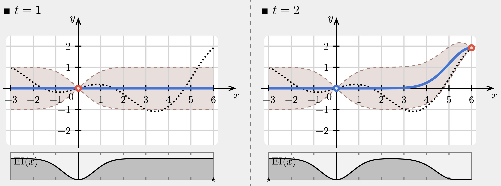
```

## Example of Bayesian Optimization in action

```{r, out.width = '100%'}
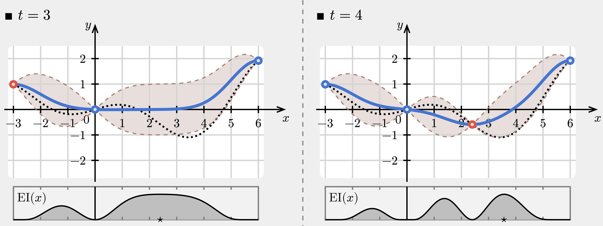
```


## Example of Bayesian Optimization in action

```{r, out.width = '100%'}
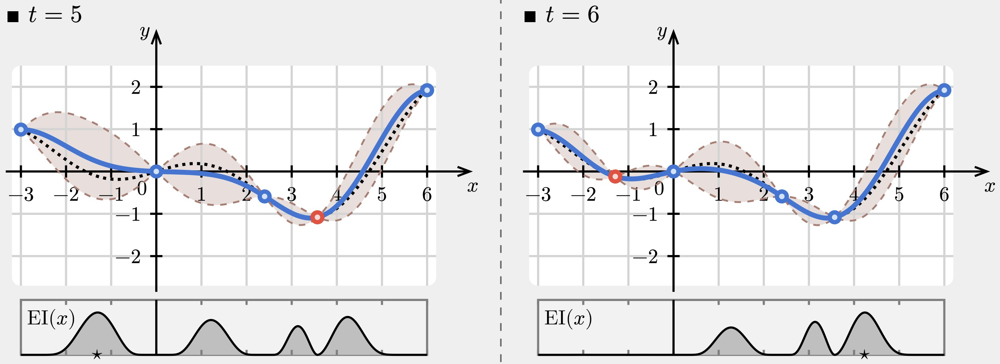
```


## Example of Bayesian Optimization in action

```{r, out.width = '100%'}
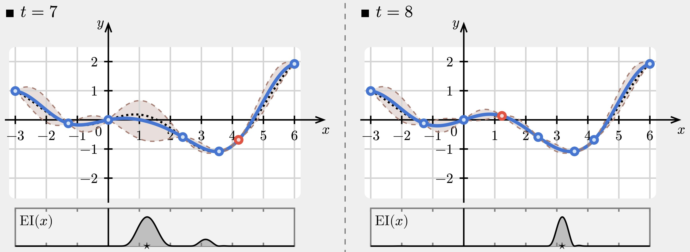
```


## Example of Bayesian Optimization in action

```{r, out.width = '100%'}
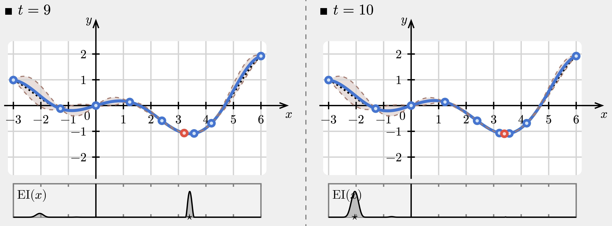
```

## Exploration versus Exploitation

<div style="float: left; width: 50%;">

```{r, out.width = '100%'}
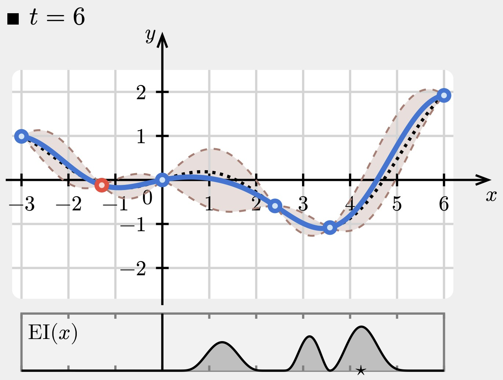
```

</div>

<div style="float: right; width: 45%;">

Explore points with high variance.

Exploit points most likely to be minimum.

</div>


## Notion of improvement

- We are minimizing our objective function $y(x)$. 
- Call the best solution so far $x_M^\star$.
- Improvement can be defined as:

$$
I(x_{\texttt{next}}) = \max\left\{0, f(x_M^\star) - \widetilde{f}(x_{\texttt{next}}) \right\}
$$

Each point $x_{\texttt{next}}$ in a Gaussian process is associated with a mean given by evaluating the mean function at $x_{\texttt{next}}$, $\mu(x_{\texttt{next}})$ and a variance given by evaluating the variance function at $x_{\texttt{next}}$, $k(x, x_{\texttt{next}})$.

## Osborne et al.: One-step Lookahead

- Function evaluations so far: $(\mathbf{x}_0, \mathbf{y}_0)$
- Define $\eta := \min \mathbf{y}_0$
- Define loss function:

$$
\lambda(y) := \begin{cases}
y;\quad y < \eta \\
\eta;\quad y \ge \eta
\end{cases}
$$

Fancy way of saying loss is $\min(y, \eta)$.

## Osborne et al.: Expected loss

$$
\mathbb{E}[\lambda(y)] := \int_{y=-\infty}^{y=\infty} \lambda(y)\cdot p(y \,| \,x, I_0) \, dy
$$

where $x$ is the new selected point and $I_0$ is the current "knowledge" (e.g., Gaussian process parameters).

Our integral must be split at the critical value $\eta$. When $y<\eta$, $\lambda(y)=y$ and when $y\ge\eta$, $\lambda(y)=\eta$.

$$
\mathbb{E}[\lambda(y)] := \int_{y=-\infty}^{y=\eta} y\cdot p(y \,| \,x, I_0) \, dy + \int_{y=\eta}^{y=\infty} \eta\cdot p(y \,| \,x, I_0) \, dy
$$

## Osborne et al.: Expected loss

Note that $p(y \,| \,x, I_0)$ is driven by the Gaussian process!

$$
p(y \,| \,x, I_0) = \mathcal{N}\big(y; m(y\,|\,I_0), k(y_0,y\,|\,I_0)\big)
$$

Plugging this into the integrals, we get 

$$
\begin{multline}
\mathbb{E}[\lambda(y)] = \int_{-\infty}^{\eta} y\cdot \mathcal{N}\big(y; m(y\,|\,I_0), k(y_0,y\,|\,I_0)\big) \, dy \\ + \int_{\eta}^{\infty} \eta\cdot \mathcal{N}\big(y; m(y\,|\,I_0), k(y_0,y\,|\,I_0)\big) \, dy
\end{multline}
$$

$$
\begin{multline}
=\eta + (m(y\,|\,I_0) - \eta) \Phi(\eta\,|\,m(y\,|\,I_0),k(y_0,y\,|\,I_0)) \\ - k(y_0,y\,|\,I_0)\phi(\eta\,|\,m(y\,|\,I_0),k(y_0,y\,|\,I_0) )
\end{multline}
$$

## Figure 1: Expected loss in action

```{r, out.width = "65%", fig.align = "center"}
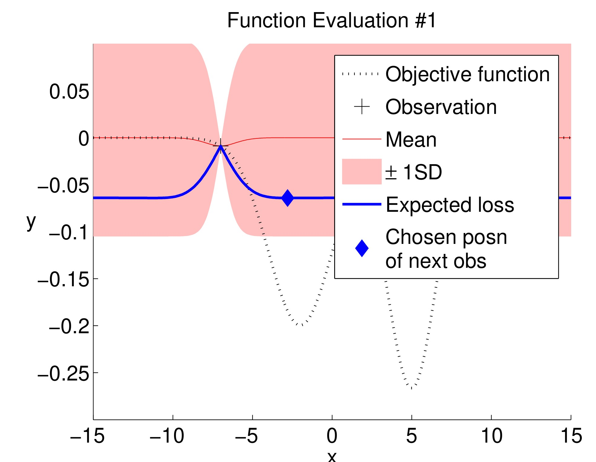
```

## Figure 1: Expected loss in action

```{r, out.width = "65%", fig.align = "center"}
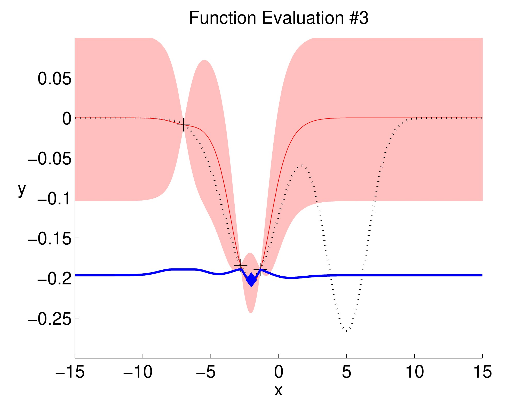
```

## Figure 1: Expected loss in action

```{r, out.width = "65%", fig.align = "center"}
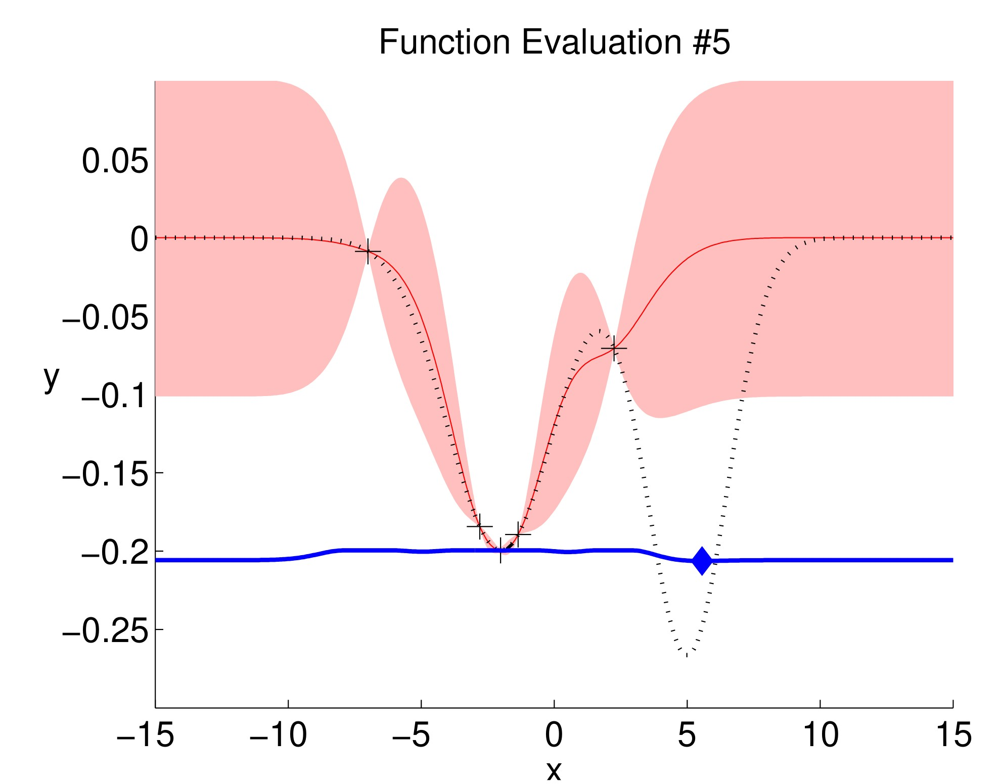
```

## Figure 1: Expected loss in action

```{r, out.width = "65%", fig.align = "center"}
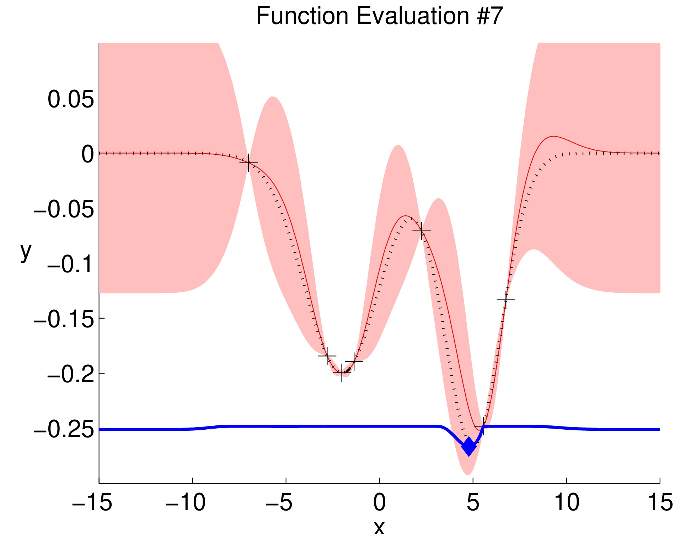
```

## Derivative observations, avoiding conditioning problems

- Strongly correlated observations makes for poorly conditioned covariance matrices
- Derivative observations can be seamlessly incorporated into a GP
- A function over which we have a GP is jointly Gaussian with its derivatives
- Derivative observations can be treated just as observations of the function itself (with modified covariance function)
- A derivative is only weakly correlated with the function very nearby, improving conditioning

## Results of GPGO

GPGO was used to find the optima for several known, difficult functions.

```{r, out.width = "60%", fig.align = "center"}
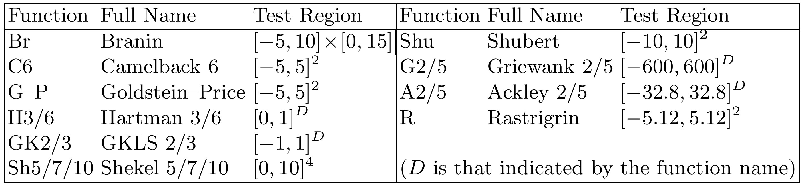
```

Performances was measured using "gap":

$$
G := \frac{y(x^{\texttt{first}}) - y(x^{\texttt{best}})}{y(x^{\texttt{first}}) - y^{\texttt{opt}}}
$$

- $y^{\texttt{opt}}$ is the known global optimum
- $x^{\texttt{first}}$ and $x^{\texttt{best}}$ are the first point evaluated and best point found

## Results of GPGO

```{r, out.width = "65%", fig.align = "center"}
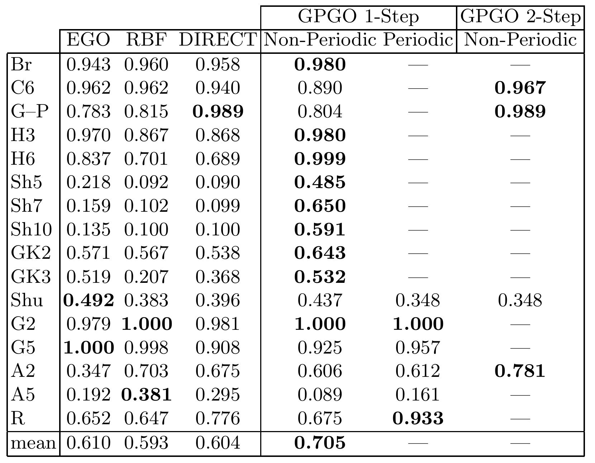
```

## Limitations and future work

- Work does not explore optimization problems with which the new GPGO method might struggle or fail
- Explore reasons for lower performance of GPGO compared to other methods when optimizing certain functions such as Shu or A5
- Plan to apply BO methods to computationally intensive objection functions in clinical trial design

## Credit

Journal article: @osborne2009gaussian  
  
Mathematics/derivations: @williams2006gaussian, @osborne2009gaussian  
  
Inspiration for some of the visualizations: @turner2016machine, @gramacy2022surr, and @gramacy2022surrPart2  
  
Bayesian optimization visualization: @farina2024lecture  
  

## References {.smaller}
